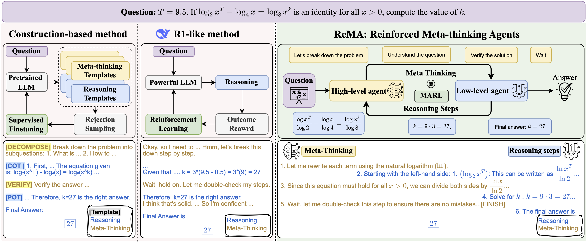
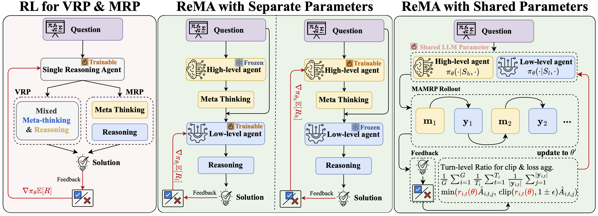
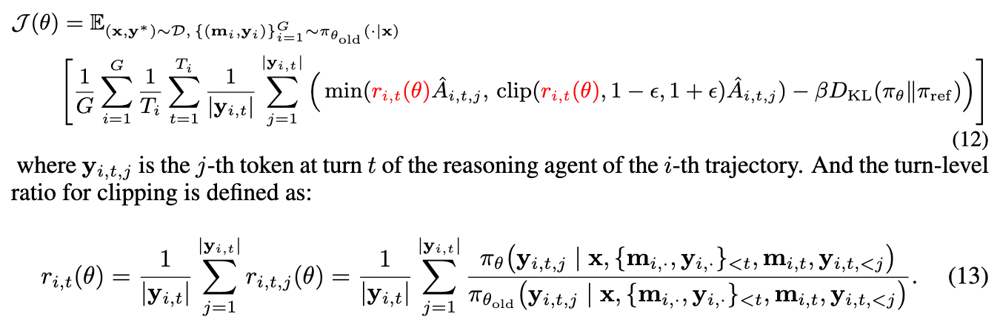
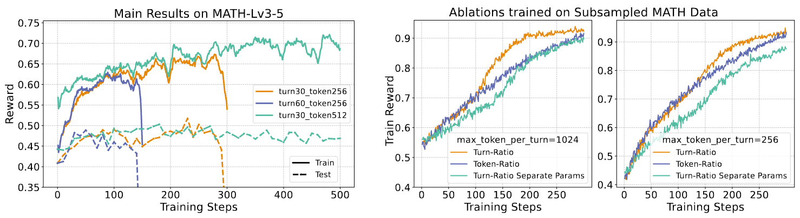

# ReMA Project
This is an open-source framework for Multi-Agent Multi-Turn Reinforcement Learning, i.e. **Re**inforced **M**ulti-**A**gents (ReMA).

## Overview

We implement the paper *Learning to Meta-think for LLMs with Multi-Agent Reinforcement Learning* as an initial example.
In this work, we decouples the reasoning process into two hierarchical agents: a high-level meta-thinking agent responsible for generating strategic oversight and plans, and a low-level reasoning agent for detailed executions.

We support two types of training:



### ReMA with Separate Parameters
In this mode, the high-level agent (meta-thinking) and the low-level agent (reasoning) are parameterized separately. The high-level agent is frozen while the low-level agent is trainable, or vice versa. This allows for independent optimization of meta-thinking and reasoning abilities.

### ReMA with Shared Parameters
In this mode, both the high-level and low-level agents share the same set of parameters. The training is performed end-to-end, and feedback is used to update the shared parameters jointly. This enables unified learning of both meta-thinking and reasoning within a single model.


### Turn-level Ratio 



We also proposed a turn-level ratio for clip and loss averaging, which is more efficient and effective than token-level ratio.


## Installation
we recommend using cuda12.4 + torch2.6 + python3.10.
```bash
conda create -n rema python=3.10
conda activate rema
# install flash-attn (faster)
# wget https://github.com/Dao-AILab/flash-attention/releases/download/v2.7.4.post1/flash_attn-2.7.4.post1+cu12torch2.6cxx11abiFALSE-cp310-cp310-linux_x86_64.whl
# pip install flash_attn-2.7.4.post1+cu12torch2.6cxx11abiFALSE-cp310-cp310-linux_x86_64.whl --no-build-isolation

# install flash-attn
pip install flash-attn==2.7.4.post1 --no-build-isolation

# for sft
cd src/360-LLaMA-Factory
pip install -e .

# for RL
cd src/verl
pip install -e .

# update libs
pip install -r requirements.txt
```

## Training


### How to run scripts
To run the training, you can see `scripts/rl/rema/example_7b.sh` as an example.
```bash
bash scripts/rl/rema/example_7b.sh
```

key arguments:
- Rollout
    - `data.max_prompt_length`: max length of prompt, **for each turn's input**
    - `data.max_response_length`: max length of response **per turn**
    - `actor_rollout_ref.rollout.stop_when_truncated=True`: whether to stop when truncated, i.e. last agent's response is stopped by length

- Training:
    - `actor_rollout_ref.actor.clip_mode`: ratio clip mode, `"turn"` or `"batch"`
    - `actor_rollout_ref.actor.agg_mode`: ratio aggregation mode, `"trajectory"` or `"batch"` or `"turn"`

- For Separated Trainer:
    - `algorithm.switch_agent.enable=True`: whether to use separated trainer
    - `algorithm.switch_agent.freq=10`: switch agent frequency
    - `algorithm.switch_agent.model_paths`: model paths of two agents, **Previous `actor_rollout_ref.model.path` will be ignored**

see `src/verl/verl/rema_trainer/config/ppo_trainer.yaml` and `src/verl/verl/rema_separated_trainer/config/ppo_trainer.yaml` for more details.


## Evaluation
A very easy way is to set
```
+trainer.val_before_train=True \
+trainer.val_only=True \
```
in the training scripts.


## Basic Results

- Multi-agent Multi-turn RL training is still highly sensitive and often unstable(collapse)
- Turn-level ratio is more efficient and effective than token-level ratio.


## Citation
If you find this work useful, please consider citing:
```
@article{wan2025rema,
  title={Rema: Learning to meta-think for llms with multi-agent reinforcement learning},
  author={Wan, Ziyu and Li, Yunxiang and Song, Yan and Wang, Hanjing and Yang, Linyi and Schmidt, Mark and Wang, Jun and Zhang, Weinan and Hu, Shuyue and Wen, Ying},
  journal={arXiv preprint arXiv:2503.09501},
  year={2025}
}
```